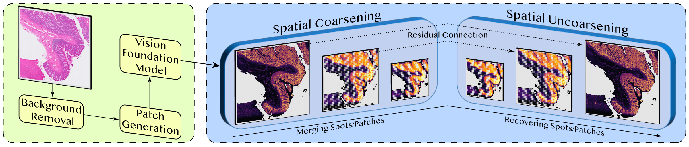
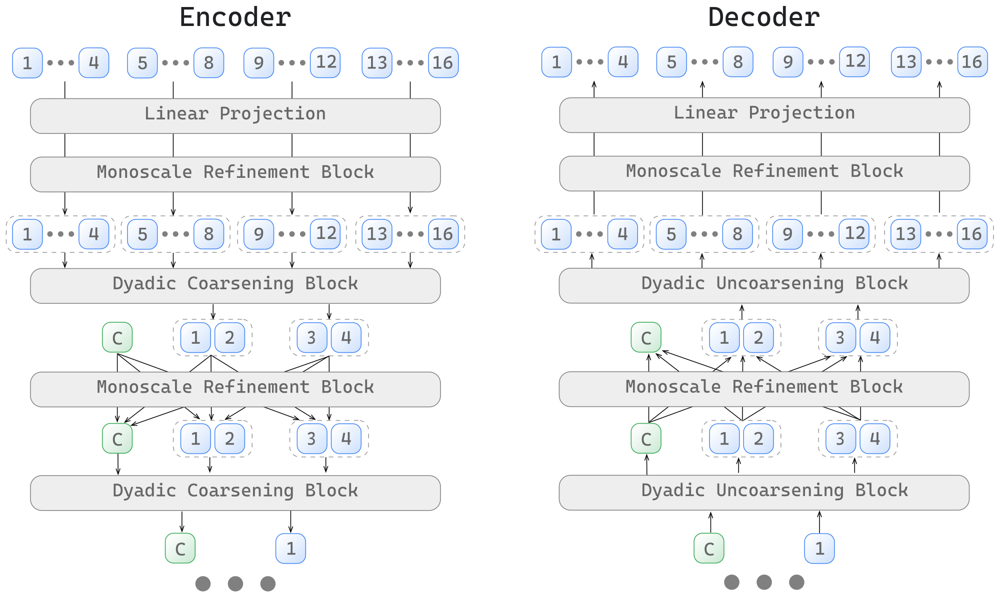

# HiST

[](https://arxiv.org/abs/2606.14251)
[](https://icml.cc/virtual/2026/poster/61463)
[](pyproject.toml)
[](LICENSE)

Official PyTorch implementation of **HiST: A Hierarchical Sparse Transformer for
Cross-Modal Spatial Transcriptomics Modeling** (ICML 2026).

HiST predicts a gene-expression vector at each measured spatial-transcriptomics
(ST) location from its co-registered H&E image patch. It represents the measured
locations as a sparse field on a compact two-dimensional lattice, builds
multiscale context with a sparse encoder-decoder, and avoids creating feature
tokens for unobserved background locations.

> [OpenReview](https://openreview.net/forum?id=ptbzlHzmEv) ·
> [Preprocessing](https://github.com/wwyi1828/PatchPreprocess) ·
> [SPAN](https://github.com/wwyi1828/SPAN)

<p align="center">
  <a href="assets/hist-overview.png">
    
  </a>
</p>
<p align="center">
  <em><strong>HiST overview.</strong> Patch embeddings are arranged on a sparse
  lattice, modeled across spatial scales, and recovered at measured ST sites.</em>
</p>

## Highlights

- **Lattice-indexed sparse modeling.** Image features stay aligned with the
  observed tissue footprint instead of being padded into a dense slide-level
  feature tensor.
- **Dyadic spatial hierarchy.** Coordinate-indexed downsampling expands the
  receptive field rapidly; occupancy-aware pixel shuffle restores the original
  measured support in the decoder.
- **Local and slide-level context.** Sparse regular/shifted-window attention
  models local geometry, while configurable global tokens provide a
  low-bandwidth slide-level conditioning path.
- **Coordinate-only augmentation.** Reflection, shear, rotation, and spot
  dropout remain available with precomputed patch embeddings, so patch images
  do not need to be re-encoded every epoch.
- **Four patch-encoder regimes.** Use precomputed embeddings, a frozen image
  encoder, parameter-efficient LoRA adaptation, or full end-to-end fine-tuning.

## Table of contents

- [Architecture at a glance](#architecture-at-a-glance)
- [Installation](#installation)
- [Quick start](#quick-start)
- [Data preparation](#data-preparation)
- [Training and outputs](#training-and-outputs)
- [Advanced model interfaces](#advanced-model-interfaces)
- [Implementation guide](#implementation-guide)
- [Configuration reference](#configuration-reference)
- [Repository map](#repository-map)
- [Citation and acknowledgements](#citation-and-acknowledgements)
- [License](#license)

## Architecture at a glance

The default `slide_configs: "111-21"` uses three encoder resolutions and two
decoder resolutions. It projects 1024-dimensional UNI features to width 512,
coarsens the sparse lattice twice, and recovers the original measured support
with same-scale skip features. Three global tokens carry slide-level context,
and a final linear head predicts log-expression at every input location. See
[`configs/model/hist.yaml`](configs/model/hist.yaml) for the released settings.

### Scope

HiST consumes aligned ST locations and H&E patches or patch embeddings. It does
not open raw whole-slide images, perform registration, or choose new prediction
locations. Those operations belong in the preprocessing pipeline. Predictions
are produced at the supplied measured locations.

## Installation

HiST requires Python 3.9 or later. A GPU is recommended but not required by the
training entrypoint.

```bash
git clone https://github.com/wwyi1828/HiST.git
cd HiST

python -m venv .venv
source .venv/bin/activate
python -m pip install --upgrade pip
pip install -e .
```

The model uses PyTorch and DGL. If the default resolver does not select builds
compatible with your CUDA runtime, install the matching PyTorch and DGL builds
first, then run `pip install -e .`.

For raw-patch modes with the UNI encoder, obtain the weights under the
[UNI terms of use](https://github.com/mahmoodlab/UNI) and set:

```bash
export UNI_WEIGHTS=/path/to/uni_weights.bin
```

`UNI_WEIGHTS` is not needed in the default `precomputed` mode.

## Quick start

With preprocessed features under `HIST_DATA_ROOT`, train the default
precomputed-UNI model on one fold:

```bash
export HIST_DATA_ROOT=/path/to/processed_datasets

python -m tasks.gene_prediction.main \
  dataset=NCBI_brain \
  test_fold=1 \
  logging.wandb.enabled=false
```

HiST uses Hydra, so any setting can be overridden with a dotted command-line
key. The sections below define the data contract, training modes, outputs, and
supported architecture options.

## Data preparation

Datasets and model weights are not bundled with this repository. The companion
[PatchPreprocess](https://github.com/wwyi1828/PatchPreprocess) repository prepares
HEST-style spatial-transcriptomics data and patch features in the layout consumed
by HiST. The upstream [HEST library](https://github.com/mahmoodlab/hest) can be
used to obtain and standardize H&E-ST pairs.

### Using PatchPreprocess

The unified preprocessing path expects HEST-style inputs:

```text
/path/to/HEST1K/
├── st/<sample_id>.h5ad
├── patches/<sample_id>.h5
└── metadata/<sample_id>.json
```

The unified entrypoint, `pipeline/extract_molmor_feats_unified.py`, harmonizes
genes, matches expression and morphology rows by barcode, derives the coordinate
representations below, and writes aligned H5 files. Follow PatchPreprocess for
its environment and current CLI, and use one preprocessing revision and gene
vocabulary across all folds in an experiment.

### Directory layout

Set the root once:

```bash
export HIST_DATA_ROOT=/path/to/processed_datasets
```

A precomputed-feature dataset should look like:

```text
$HIST_DATA_ROOT/
└── ALLVisium/
    └── NCBI_brain/
        ├── gene/
        │   ├── slide_001.h5
        │   └── slide_002.h5
        └── imge_UNI/
            ├── slide_001.h5
            └── slide_002.h5
```

Raw-patch training uses `imge_RAW/` instead of `imge_UNI/`. Dataset locations are
declared in [`configs/dataset_config/`](configs/dataset_config); a path can also
be overridden directly with Hydra.

### H5 contract

The gene and image files for a slide must have the same stem, number of rows,
and spot order. Row `i` in every spot-level array must refer to the same barcode
or measured location; the current loader assumes this alignment and does not
reconstruct it.

| File | Key | Status | Shape / dtype | Purpose |
|---|---|---|---|---|
| `gene/<slide>.h5` | `mol_feats` | Required | `[N, G]`, floating point | Non-negative expression in linear space. HiST applies `log1p` internally; do not store already-log-transformed targets. |
| | `cords` | Required | `[N, 2]`, integer | Canonical non-negative, unique lattice coordinates used for evaluation and as the fallback training coordinates. The spelling is part of the current file format. |
| | `float_cords` | Required for coordinate augmentation | `[N, 2]`, float32 | Continuous near-lattice coordinates transformed before collision-free integer mapping. Without this key, training silently falls back to `cords`. |
| | `union_gene_names` | Required by the default export path | `[G]`, strings | Gene names in exactly the same order as columns of `mol_feats`. |
| | `hvg_indices` / `heg_indices` | Required when selected by `gene_type` | one-dimensional integer arrays | Ordered column indices used to select HVGs or HEGs. |
| | `orig_cords` | Optional | `[N, 2]`, floating point | Original pixel/physical coordinates for provenance and visualization. |
| `imge_<BACKBONE>/<slide>.h5` | `mor_feats` | Required in `precomputed` mode | `[N, C]`, floating point | Patch embeddings whose width matches the configured backbone input, for example 1024 for UNI. |
| `imge_RAW/<slide>.h5` | `mor_feats` | Required in raw-patch modes | `[N, H, W, 3]` | Raw RGB H&E patches on a `[0, 255]` scale for `frozen`, `lora`, or `full`. |

If you add custom spot-level arrays, extend
[`dataset.py`](tasks/gene_prediction/dataset.py) so they follow the same filtering
and sorting operations as the declared fields.

### Coordinate system: continuous geometry, integer operators

The raw ST coordinates do **not** need to be integers. The coordinates passed to
the sparse model do: they must be non-negative, unique, compact integer lattice
indices. A typical conversion from pixel coordinates `p` is:

```text
step_px     = target_lattice_unit_um / source_mpp_um_per_px
float_cords = (p - min(p, axis=0)) / step_px
cords       = collision_free_integer_map(float_cords)
```

The companion preprocessing code computes this mapping from the source image
resolution and the requested physical patch/lattice unit. It retains the original
and continuous coordinates because integerization is an approximation, not a
lossless coordinate transform. HiST's runtime mapper rounds near-lattice points,
resolves collisions by assigning an unused nearby grid site, and translates the
result so that both coordinate minima are zero.

Integer dtype alone is not sufficient. Do not pass unnormalized WSI pixel
coordinates directly: large gaps create an unnecessarily large lookup canvas,
and duplicate coordinates overwrite the one-site/one-token correspondence.
The current attention rulebook casts lattice coordinates to signed 16-bit
integers before computing the canvas size, so each coordinate maximum must be at
most 32766. In practice the memory cost of the temporary canvas usually demands
a much tighter range.

The integer lattice defines dyadic parent-child relationships, attention-window
membership, and local relative positions. For irregular or subcellular assays,
the lattice unit and collision policy are therefore modeling choices.

Before training, verify that expression is finite and non-negative; gene and
image files have identical, barcode-aligned rows; `union_gene_names` matches the
expression width; `cords` contains unique non-negative integer pairs with
`max <= 32766`; and `float_cords` is present when coordinate augmentation is
required. Matching row counts alone cannot prove barcode alignment.

### Registering datasets and groups

Dataset discovery is a Hydra registry rather than a hard-coded path list. Add a
file under [`configs/dataset_config/`](configs/dataset_config), for example:

```yaml
# configs/dataset_config/my_study.yaml
# @package _global_
datasets:
  cohort_a:
    path: "${oc.env:HIST_DATA_ROOT,./data}/cohort_a"
    gene_dir: "gene"
    gene_type: "hvg"
    num_genes: 2000
```

| Field | Contract |
|---|---|
| `path` | Dataset root containing the gene and image-feature folders. |
| `gene_dir` | Gene-file directory, relative to `path` or absolute. Defaults to `gene`. |
| `gene_type` | `hvg`, `heg`, or `null` for all columns. The corresponding ranking key must exist when `hvg` or `heg` is selected. |
| `num_genes` | Positive prefix length of the selected ranking, or `null` for the complete ranking/all columns. |

Select it with `dataset_config=my_study dataset=cohort_a`. Registry files may
also define named `dataset_groups` containing multiple registered datasets. A
group is valid only when its members share the same selected genes in the same
order, morphology width, target scale, and coordinate convention; equal
`num_genes` values are not sufficient. These invariants are not validated by
the loader.

`test_fold` is a one-based value in `1..4`. Splits are generated from slide files
at runtime; save the resolved slide lists for reproducibility, and avoid cohorts
with fewer than four slides.

## Training and outputs

### Inspecting configurations and sweeps

Inspect the fully composed and resolved configuration without opening data or
starting training:

```bash
python -m tasks.gene_prediction.main \
  --cfg job --resolve \
  dataset=NCBI_brain \
  model.pos_emb=alibi
```

Hydra does not save its usual `.hydra/` snapshot in this project, so archive the
resolved configuration and slide split with results intended for reproduction.

Hydra multirun can execute all four runtime folds:

```bash
python -m tasks.gene_prediction.main --multirun \
  dataset=NCBI_brain \
  test_fold=1,2,3,4 \
  logging.wandb.enabled=false
```

For sweeps, assign each condition a unique, filename-safe
`logging.results.save_path` such as `hist_rope`; the automatic model slug does
not encode every override and can otherwise collide.

### Patch-encoder modes

HiST always trains the sparse spatial encoder-decoder and gene head. The mode
controls how morphology features are obtained and whether the image encoder is
also updated:

| `model.train_mode` | Input folder | Additional trainable parameters | Pixel augmentation | Typical use |
|---|---|---|---|---|
| `precomputed` | `imge_<patch_backbone>/` | None in the patch encoder (identity) | No | Default and fastest; reuse embeddings while retaining coordinate augmentation. |
| `frozen` | `imge_RAW/` | None; image-encoder weights stay frozen | Optional | Re-encode raw patches and experiment with pixel-space augmentation. |
| `lora` | `imge_RAW/` | LoRA adapters on the attention Q/K projections | Optional | Adapt the image encoder with substantially fewer trainable parameters. |
| `full` | `imge_RAW/` | The complete image encoder (`full` means trainable) | Optional | End-to-end fine-tuning with the highest memory and compute cost. |

Raw-patch modes instantiate the UNI-style ViT-L/16 encoder and do not download
weights. Set `UNI_WEIGHTS` and verify that the log reports
`Successfully loaded weights for ViT`; a missing or incompatible checkpoint
currently leaves the backbone randomly initialized. Pixel augmentation is
enabled with `training.patch_aug=true`, independently of coordinate augmentation.

Example LoRA run:

```bash
python -m tasks.gene_prediction.main \
  dataset=NCBI_brain test_fold=1 \
  patch_backbone=UNI model.train_mode=lora \
  model.lora_rank=8 model.lora_alpha=16 \
  model.lora_lr_mult=5.0 training.patch_aug=true \
  logging.wandb.enabled=false
```

`model.lora_rank`, `model.lora_alpha`, and `model.lora_lr_mult` control Q/K
adapter capacity, scaling, and learning rate.

### Output contracts

By default, aggregate metrics are written to:

```text
results/gene_prediction/hist.json
```

Final-epoch per-slide predictions and slide tokens are written under:

```text
results/gene_prediction/predictions/hist/<model_config>/<run>_fold<k>/
results/gene_prediction/slide_token/hist/<model_config>/<run>_fold<k>/
```

Each prediction H5 contains:

| Key | Shape | Meaning |
|---|---|---|
| `predictions` | `[N, G]` | Non-negative predictions in linear expression space after `expm1` and ReLU. |
| `targets` | `[N, G]` | Linear-space targets from `mol_feats`. |
| `coords` | `[N, 2]` | Sorted integer lattice coordinates used for evaluation. |
| `gene_names` | `[G]` | Byte strings aligned with prediction columns. |

Rows are in coordinate-sorted model order rather than the original H5 order.
Use the exported `coords` for downstream joins; prediction files do not retain
barcodes, original row indices, or `orig_cords`. Dataset-group members must also
have unique slide stems because the dataset name is not added to each H5 file.

Each slide-token H5 contains:

| Key | Shape | Meaning |
|---|---|---|
| `slide_token` | `[2T, D]` by default | The final encoder global tokens followed by the decoder pre-output global tokens. `T` is the number of valid token initializers; the released model uses `T=3`, `D=512`. |
| `token_init_types` | `[T]` | Initializer labels such as `max`, `mean`, and `fix1e-4`. |

Setting `logging.results.save_predictions=false` suppresses both per-slide
prediction files and slide-token files. The aggregate JSON remains enabled and
stores each metric as a four-element fold array under:

```text
<run>/<model_config>/spot_metrics/<metric>
<run>/<model_config>/slide_avg_metrics/<metric>
```

Here, `spot_metrics` is a pooled metric over all flattened spot–gene entries,
not an average of one metric per spot. `slide_avg_metrics` computes the same
flattened metric separately for each slide and then takes the unweighted mean
over slides.

> Metrics and H5 exports correspond to the final epoch. The current entrypoint
> does not save a restorable checkpoint, and `logging.mode=best` does not select
> or restore the best validation epoch.

The training objective is mean squared error in `log1p` expression space. Final
evaluation reports coefficient of determination (`R2`) and Pearson correlation
coefficient (`PCC`) on linear-space values, matching the paper. Their order or a
subset can be selected through `training.eval_metrics`.

## Advanced model interfaces

The options below are the supported Hydra controls for architecture experiments.

### Topology DSL

`model.slide_configs` is a compact depth-per-resolution string:

```text
111-21
^^^ ^^
enc dec
```

Each character gives the Transformer depth at one resolution. In `111-21`, the
encoder has three resolutions with one layer each and the decoder has depths two
and one. The first encoder stage projects the input; later encoder stages
coarsen, decoder stages recover, and the prediction head is appended
automatically. Depths are single digits. Gene prediction requires one fewer
decoder stage than encoder stages, and the released hierarchy assumes kernel 2
and stride 2.

### Slide-calibration tokens and embeddings

`model.token_init_types` accepts an ordered list of global-token initializers:

| Initializer | Behavior |
|---|---|
| `mean`, `max`, `std` | Pool the current slide's input patch features. |
| `fix<scale>` | Create a fixed random buffer, for example `fix1e-4`. |
| `lrn<scale>` | Create a learned parameter, for example `lrn1e-4`. |
| numeric value | Create a fixed random buffer with that standard deviation. |
| `[]` | Disable global tokens entirely. |

The default `[max, mean, fix1e-4]` creates three tokens. With `hybrid`
attention, they exchange information with local spatial tokens;
`model.share_qkv=true` shares Q/K/V projections between the two paths, while the
default uses separate projections.

At each resolution change, `model.global_strategy` controls the token path:

| Value | Global-token update |
|---|---|
| `proj` | Independent learned linear projection (default). |
| `identity` | Identity when widths match; otherwise a learned width projection. |
| `kernel` | Reuse the local spatial operator's feature transform followed by its pooling rule. |

Final encoder and decoder tokens are saved through the schema described in
[Output contracts](#output-contracts).

### Operator and attention ablations

The following options form the documented experiment surface:

| Interface | Supported values | Notes |
|---|---|---|
| `model.econvs_type` | `patchconv` (default), `dwpatchconv`, `patchmerge` | Sparse encoder coarsening; `patchmerge` uses canonical four-child slots. |
| `model.dconvs_type` | `pixelshuffle` (default), `patchinvs` | Sparse decoder recovery intersected with cached active support. |
| `model.trans_type`, `model.dtrans_type` | `hybrid` (default), `hybrid_noshift`, `swin` | `hybrid_noshift` removes shifted windows but keeps global exchange; `swin` uses regular/shifted local graphs without local–global edges. |
| `model.pos_emb` | `rpb` (default), `alibi`, `rope`, `none` | Learned relative bias, 2D distance ALiBi, 2D rotary Q/K, or an ablation without positional encoding. |
| `model.connection` | `concat` (default), `add`, `none` | Encoder–decoder skip fusion. |
| `model.edge_mode` | `none` (default), `count`, `partial` | Optional incomplete-neighborhood normalization for sparse patch convolution. |

For `patchmerge`, both non-`none` edge modes reduce to count normalization; the
`count`/`partial` distinction applies to sparse patch convolution.

## Implementation guide

This section follows the forward path in source-code order. For supported
experiment knobs and commands, use [Advanced model interfaces](#advanced-model-interfaces).

### 1. Input projection and padding

[`PredictionModel`](tasks/gene_prediction/model.py) obtains one patch feature per
measured location, and the first encoder block projects it to the model width.
`SPAN_Padder` adds zero-feature boundary sentinels so repeated stride-2
coarsening and recovery have compatible shapes; the sentinels are removed before
prediction. The configured slide-calibration tokens follow a parallel
low-bandwidth path and exchange information with local tokens under `hybrid`
attention.

### 2. Efficient coordinate augmentation

Coordinate augmentation is built in [`lib/utils/coord_aug.py`](lib/utils/coord_aug.py)
and [`src/span/preprocessing/transforms.py`](src/span/preprocessing/transforms.py).
For one slide it:

1. centers `float_cords` and composes mirror, shear, and rotation into one
   `2 x 2` matrix;
2. transforms all `N` coordinates in one matrix multiplication;
3. optionally drops spots and applies the same mask to image features,
   expression targets, and aligned metadata;
4. translates the transformed support to the origin and maps it to collision-free
   integer coordinates; and
5. sorts coordinates and every aligned spot-level tensor with the same index.

This changes only an `N x 2` coordinate array and reuses the precomputed
`N x C` patch embeddings, so patches are neither re-extracted nor re-encoded.
`drop.p` is the probability of dropping a spot: `p=0.75` retains roughly 25%
when its multiplier is 1. The optional epoch-dependent probability schedule is
experimental with persistent DataLoader workers.

### 3. Sparse spatial downsampling and upsampling

The current default encoder uses sparse `patchconv` with kernel 2 and stride 2.
The implementation keeps the feature table sparse while using a compact integer
ID map to gather only the neighborhoods that contribute to active output sites.
Missing child sites contribute zero. Optional `count` and `partial` edge modes
can compensate for incomplete neighborhoods; the released config uses `none`.

HiST also provides a dyadic `patchmerge` path. For each fine coordinate `c`:

```text
parent = (c0 // 2, c1 // 2)
slot   = 2 * (c0 % 2) + (c1 % 2)
```

Up to four children are scattered into canonical slots, concatenated, and
projected to the next-stage width.

<p align="center">
  <a href="assets/hist-dyadic-encoder-decoder.png">
    
  </a>
</p>
<p align="center">
  <em><strong>Dyadic encoder-decoder.</strong> Each encoder stage groups active
  child sites into coarse parent tokens; the decoder reverses the hierarchy on
  the cached active support. The green C illustrates the slide-level global-token
  stream; the released configuration carries three such tokens.</em>
</p>

Before coarsening, the encoder caches the active support at each resolution.
Sparse pixel shuffle expands every parent feature into four candidate children,
maps them to `2 * parent + offset`, and keeps only candidates present in the
matching cached support. Recovery therefore returns predictions only at measured
locations and remains aligned with same-resolution skip features.

**Sparsity note.** Feature tensors and attention edges remain sparse, but some
operators create an `H x W` integer ID or occupancy map over the tight coordinate
bounding box. Memory is therefore sensitive to coordinate range as well as spot
count. Compact lattice coordinates are part of the data contract.

### 4. Sparse window and global attention

[`AttentionBuilder`](src/span/layers/attention.py) scatters active token IDs onto
a tight lattice map, partitions occupied sites into regular and shifted windows,
and creates DGL edges only between valid token pairs. Under `hybrid` attention,
a second graph adds local-to-global, global-to-local, and global-to-global
interactions. `window_size` is a half-side parameter, so the released value `3`
produces `6 x 6` lattice windows.

[`TransformerLayer`](src/span/layers/transformer.py) computes Q/K/V projections,
scores only graph edges, normalizes incoming edges with DGL `edge_softmax`, and
aggregates values by message passing. It never instantiates a dense `N x N`
attention matrix. Repeated Transformer layers in the same configured stage reuse
the stage's constructed graphs.

Local attention supports learned relative positional bias (`rpb`, the default),
2D distance-based ALiBi, 2D RoPE, or no positional encoding. RPB and ALiBi are
applied only to local–local edges. RoPE rotates Q/K on both hybrid paths, using
the lattice positions for local tokens and the origin for global tokens.

### 5. Encoder, decoder, and prediction head

`SPAN_Encoder` caches local features, global features, and coordinates at every
resolution. `SPAN_Decoder` reverses the hierarchy and combines the recovered
features with encoder history using `concat`, `add`, or no skip connection.
The final linear layer produces one log-expression vector per input location.
Predictions are converted back with `expm1` and clamped to non-negative values.

## Configuration reference

HiST uses [Hydra](https://hydra.cc/). The full configuration is defined in
[`configs/gene_prediction.yaml`](configs/gene_prediction.yaml) and
[`configs/model/hist.yaml`](configs/model/hist.yaml); use `--cfg job --resolve`
to inspect every setting. The primary experiment controls are:

| Key | Meaning |
|---|---|
| `dataset_config`, `dataset`, `dataset_group` | Select a dataset registry, one dataset, or a validated harmonized group. |
| `test_fold` | One-based runtime fold in `1..4`. |
| `patch_backbone`, `model.train_mode` | Select stored features or `precomputed`, `frozen`, `lora`, or `full` image-encoder training. |
| `model.lora_rank`, `model.lora_alpha`, `model.lora_lr_mult` | Q/K adapter rank, scaling, and learning-rate multiplier. |
| `model.slide_configs` | Transformer depth at each encoder and decoder resolution. |
| `model.econvs_type`, `model.dconvs_type` | Spatial coarsening and recovery operators. |
| `model.trans_type`, `model.dtrans_type`, `model.pos_emb` | Attention and positional encoding. |
| `model.token_init_types`, `model.global_strategy`, `model.share_qkv` | Slide-calibration token initialization and resolution path. |
| `model.connection`, `model.edge_mode` | Skip fusion and sparse-neighborhood normalization. |
| `training.lr`, `training.weight_decay`, `training.epochs` | AdamW and run-length settings. |
| `training.init_bias_with_mean` | Initialize gene-head bias from mean training-fold `log1p` expression. |
| `training.coord_aug`, `training.patch_aug` | Coordinate and raw-patch augmentation. |
| `training.eval_metric_freq`, `training.eval_metrics` | Evaluation interval and final `R2`/`PCC` metrics. |
| `logging.wandb.enabled` | Enable or disable Weights & Biases. |
| `logging.results.dir`, `logging.results.save_path`, `logging.results.save_predictions` | Result namespace and per-slide export control. |

## Repository map

| Path | Responsibility |
|---|---|
| [`configs/`](configs) | Hydra task, model, dataset, and logging configuration. |
| [`tasks/gene_prediction/`](tasks/gene_prediction) | H5 loading, model assembly, training, evaluation, and export. |
| [`src/span/`](src/span) | Hierarchical sparse encoder-decoder and configuration builder. |
| [`src/span/layers/`](src/span/layers) | Sparse resolution changes, graph attention, Transformers, and positional encoding. |
| [`src/span/preprocessing/`](src/span/preprocessing) | Padding, coordinate transforms, integer mapping, and spatial utilities. |
| [`lib/backbones/`](lib/backbones) | Raw-patch UNI encoder, pixel augmentation, and LoRA injection. |
| [`lib/utils/`](lib/utils) | Coordinate augmentation, fold splitting, metrics, and result logging. |
| [`assets/`](assets) | README figures exported from the HiST manuscript. |

## Citation and acknowledgements

If you use HiST, please cite:

```bibtex
@inproceedings{
  wu2026hist,
  title={Hi{ST}: A Hierarchical Sparse Transformer for Cross-Modal Spatial Transcriptomics Modeling},
  author={Weiyi Wu and Xinwen Xu and Xingjian Diao and Siting Li and Zhi Wei and Alma Andersson and Jiang Gui},
  booktitle={Forty-third International Conference on Machine Learning},
  year={2026},
  url={https://openreview.net/forum?id=ptbzlHzmEv}
}
```

Data preparation is shared with
[PatchPreprocess](https://github.com/wwyi1828/PatchPreprocess) and builds on the
[HEST-1k](https://github.com/mahmoodlab/hest) data ecosystem. Raw-patch runs may
also depend on [UNI](https://github.com/mahmoodlab/UNI). Please cite these projects
and follow their respective data, model-weight, and software terms when used.

## License

HiST is released under the [MIT License](LICENSE). This license does not replace
the separate terms governing external datasets, pretrained weights, or upstream
software.
